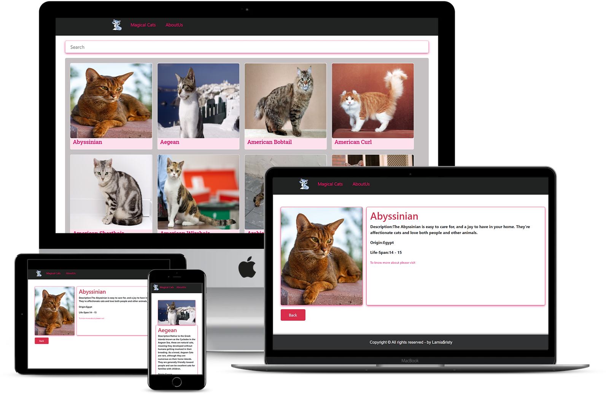

# Magic-Cats

This project is a catalogue for cat Breeds, from the whole world with links from wikiperia, which developed using React. Here I have practiced the basics of React, like,
- Props and States,
- component,
- Life-cycle methods, 
- Hooks,
- Routers,
- Styling the React app,
- Testing React components.
- Redux-toolkit.

## `Build-With:`
- ([Thecatapi](https://docs.thecatapi.com/))
- React-virtual DOM concepts
- VScode

## `Live Demo:`

[cat-pedia](https://magicalcats.herokuapp.com/)

## `Project presentations:`
[Part1-Theproject](https://www.loom.com/share/8b92c5565a994bfa9fbb974767cac387)
[Part2-TechTalks](https://www.loom.com/share/2b6be51a710748f396b4682c3c79beac)

## `Screen-shots:`

# Getting Started:

### `Prerequisites`

To get this project up and running locally, "npm install" is needed to be run in order to include all dependencies used for this project.

**To get this project set up on your local machine, follow these simple steps:**

1. Open Terminal.
2. Navigate to your desired location to download the contents of this repository.
3. Copy and paste the following code into the Terminal: git clone `https://github.com/LamiaSristy/magic-cats`.
4. Into the Terminal: run `cd magic-cats`.
5. Into the Terminal: run `npm install`.
6. Into the Terminal: run `npm start`.
7. To see the website in the browser, open browser and load `localhost:3000`.

**To run the test suits:**
1. Into the Terminal: run `npm test`.
2. Press `a` to run all tests.

## `Author Details::`

👤 **Lamia Sristy**

- Github: [@LamiaSristy](https://github.com/LamiaSristy)
- Linkedin: [@LamiaSristy](https://www.linkedin.com/in/lamia-hemayet-sristy/)
- E-mail: <a href="mailto:lamiasristy@gmail.com?subject=Hello Lamia!">Email</a>  
- Twitter: [@LamiaSristy](https://twitter.com/lsristy1)

## `Show your support:`

Give ⭐ Star me on GitHub — it helps!

## 📝 `License`

This project is [MIT](lic.url) licensed.

